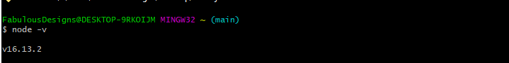
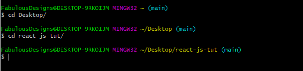

### Table of contents

- [Table of contents](#table-of-contents)
- [Node version](#node-version)
- [React folder](#react-folder)
- [Create your App](#create-your-app)

### Node version

To start with you need to check your `node version` with any command line as shown below if you have already installed `node-js` in your local machine. Make sure you have a version of more than `5` for you to run the react applications smoothly

```bash
node -v
```



You can install `nodejs` [here](https://nodejs.org/en/) if you dont have it.

### React folder

The next task is to navigate to the react folder we are working with for example i have named my folder as `react-js-tut` and it is located on Desktop as shown below.



### Create your App

Running the below command will install the necessary modules and dependencies that you require for your very first application in react.

```bash
npx create-react-app fabulous-blog
```

> Note that i have named the application as `fabulous-blog`.

A folder will be generated with the following files and folders. For example in my case i have the following
 **Folders**

- node_modules
- public
- src
  **Files**
- package-lock.json
- package.json
- readme.md

start your application by running the following command which will open your application on the browser at port `localhost:3000`. Below is the command.

```bash
npm run start

```
